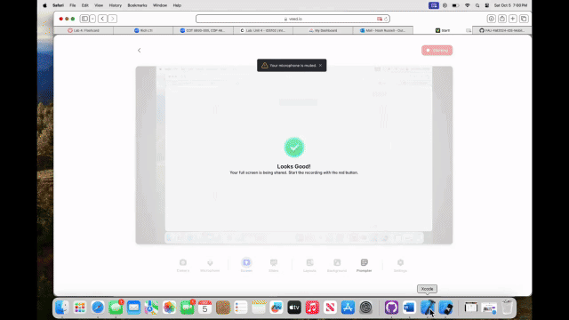

# Lab 4 - *Flashcard*

Submitted by: **Noah Russell**

**Flashcard** is an app that allows users to enhance their learning experience by viewing flashcards and seamlessly toggling between question and answer text. As you swipe left or right to navigate through your deck, the cards' colors will dynamically update to reflect your choices (green or red), making your study sessions more engaging. Need a fresh start? Easily reset the entire deck or focus on cards you’ve marked for more practice. Plus, you can create and add new flashcards to keep your learning material relevant and personalized. Dive in and start mastering your knowledge today! 

Time spent: **3** hours spent in total

## Required Features

The following **required** functionality is completed:

- [✔️] View a flashcard and toggle between the card's question and answer text
- [✔️] Understand the effects of swiping left or right by updating the cards color as the user swipes
- [✔️] Swipe left and right to progress though the deck
- [✔️] Reset the deck with all the cards or only cards they've categorized as needing more practice
- [✔️] Create new flashcards and add them to the deck
 
The following **optional** features are implemented:

- [✖️] Save cards so they're available across app launches
- [✖️] Delete cards

The following **additional** features are implemented:

- [ ] N/A

## Video Walkthrough

My video Walkthrough:

GIF created with VEED.io

## Notes

Very simple and easy to create. I will definitely be using this flashcard app on my own for some study sessions. Very fun working with SwiftUI for the first time. I'm hoping the more I work with it, the better I can become.

## License

    Copyright [2024] [Noah Russell]

    Licensed under the Apache License, Version 2.0 (the "License");
    you may not use this file except in compliance with the License.
    You may obtain a copy of the License at

        http://www.apache.org/licenses/LICENSE-2.0

    Unless required by applicable law or agreed to in writing, software
    distributed under the License is distributed on an "AS IS" BASIS,
    WITHOUT WARRANTIES OR CONDITIONS OF ANY KIND, either express or implied.
    See the License for the specific language governing permissions and
    limitations under the License.
